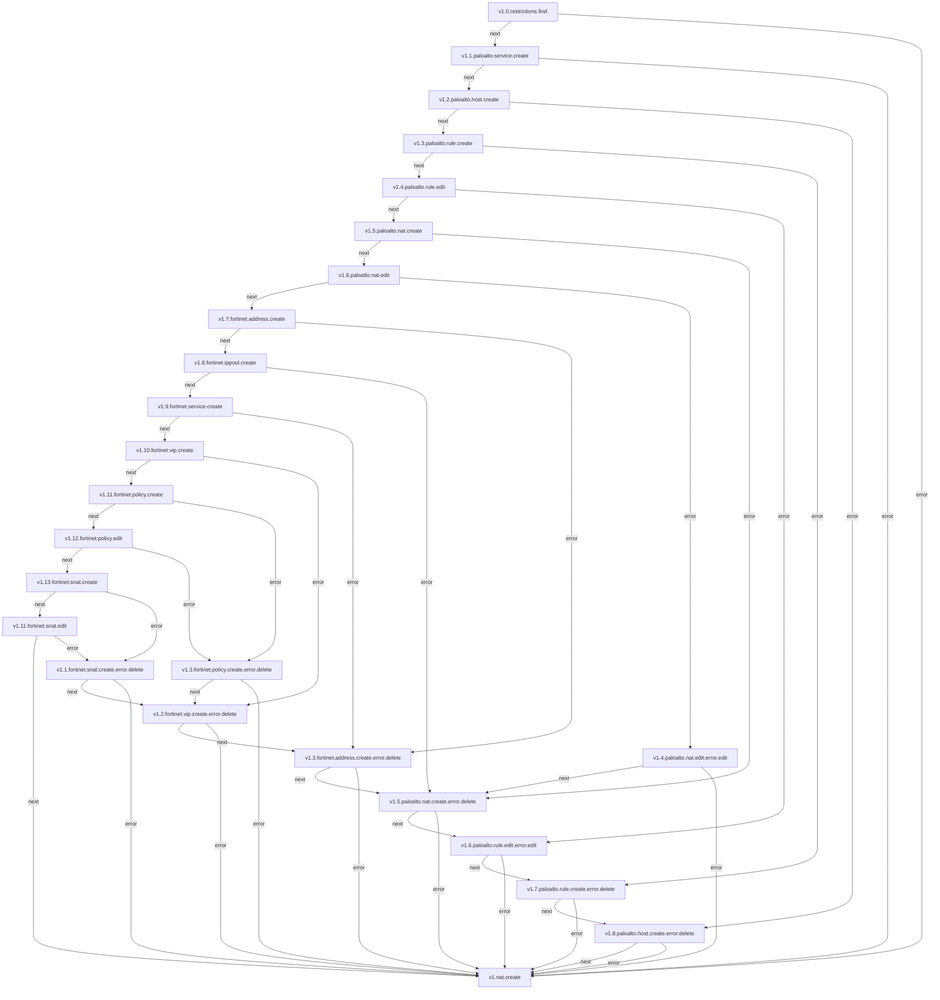
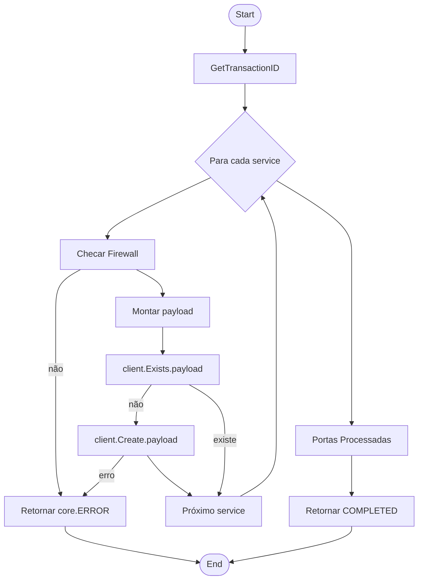

## NATs

**Objetivo:** Configurar regras de NAT (Network Address Translation) para gerenciar o tráfego de rede entre diferentes zonas ou interfaces.

### Fluxo



## Micro Serviço paloalto-service - create

### Fluxo



## Payload no Micro Serviço

```json
{
  "Name":"TCP-63000",
  "Path":"service",
  "Port": { 
    "Port":"63000"
  }
}
```

### End-Point API PaloAlto

> /restapi/v10.2/Objects/Services

### Payload API PaloAlto

```json
{
  "entry": {
    "@name": "TCP-63000",
    "description": "TCP-63000",
    "protocol": {
      "tcp": {
        "port": "63000",
      }
    }
  }
}
```