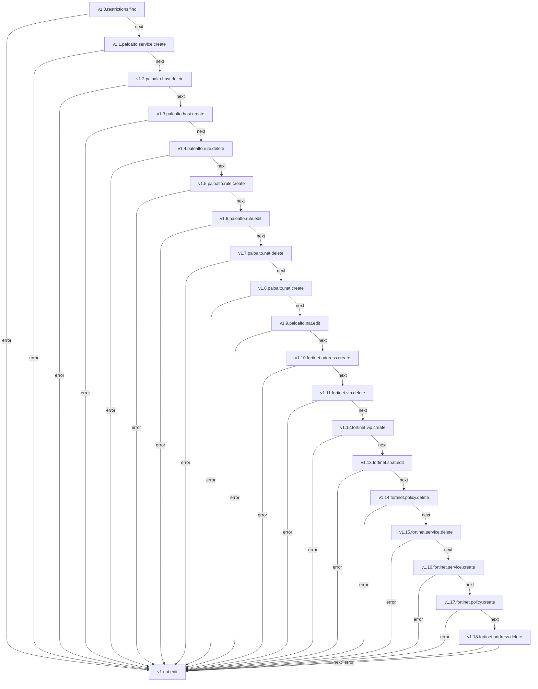

## NATs

**Objetivo:** Configurar regras de NAT (Network Address Translation) para gerenciar o tráfego de rede entre diferentes zonas ou interfaces.

### Fluxo - Criação de NAT


## Serviços envolvidos

- [v1.1.paloalto.service.create](paloalto-service.md#fluxo---service-create)
- [v1.2.paloalto.host.create](paloalto-host.md#fluxo---host-create)
- [v1.3.paloalto.rule.create](paloalto-rule.md#fluxo---rule-create)
- [v1.4.paloalto.rule.edit](#)

---

### Fluxo - Edição de NAT



### Fluxo - Remoção de NAT

```mermaid
graph TD
  v1_1_paloalto_rule_delete["v1.1.paloalto.rule.delete"] -->|next| v1_2_paloalto_rule_edit["v1.2.paloalto.rule.edit"]
  v1_1_paloalto_rule_delete["v1.1.paloalto.rule.delete"] -->|error| v1_nat_delete["v1.nat.delete"]
  v1_2_paloalto_rule_edit["v1.2.paloalto.rule.edit"] -->|next| v1_3_paloalto_nat_delete["v1.3.paloalto.nat.delete"]
  v1_2_paloalto_rule_edit["v1.2.paloalto.rule.edit"] -->|error| v1_nat_delete["v1.nat.delete"]
  v1_3_paloalto_nat_delete["v1.3.paloalto.nat.delete"] -->|next| v1_4_paloalto_nat_edit["v1.4.paloalto.nat.edit"]
  v1_3_paloalto_nat_delete["v1.3.paloalto.nat.delete"] -->|error| v1_nat_delete["v1.nat.delete"]
  v1_4_paloalto_nat_edit["v1.4.paloalto.nat.edit"] -->|next| v1_5_paloalto_service_delete["v1.5.paloalto.service.delete"]
  v1_4_paloalto_nat_edit["v1.4.paloalto.nat.edit"] -->|error| v1_nat_delete["v1.nat.delete"]
  v1_5_paloalto_service_delete["v1.5.paloalto.service.delete"] -->|next| v1_6_paloalto_host_delete["v1.6.paloalto.host.delete"]
  v1_5_paloalto_service_delete["v1.5.paloalto.service.delete"] -->|error| v1_nat_delete["v1.nat.delete"]
  v1_6_paloalto_host_delete["v1.6.paloalto.host.delete"] -->|next| v1_7_fortinet_policy_delete["v1.8.fortinet.vip.delete"]
  v1_6_paloalto_host_delete["v1.6.paloalto.host.delete"] -->|error| v1_nat_delete["v1.nat.delete"]
  v1_7_fortinet_policy_delete["v1.7.fortinet.policy.delete"] -->|next| v1_8_fortinet_vip_delete["v1.8.fortinet.vip.delete"]
  v1_7_fortinet_policy_delete["v1.7.fortinet.policy.delete"] -->|error| v1_nat_delete["v1.nat.delete"]
  v1_8_fortinet_vip_delete["v1.8.fortinet.vip.delete"] -->|next| v1_9_fortinet_snat_edit["v1.9.fortinet.snat.edit"]
  v1_8_fortinet_vip_delete["v1.8.fortinet.vip.delete"] -->|error| v1_nat_delete["v1.nat.delete"]
  v1_9_fortinet_snat_edit["v1.9.fortinet.snat.edit"] -->|next| v1_10_fortinet_snat_delete["v1.10.fortinet.snat.delete"]
  v1_9_fortinet_snat_edit["v1.9.fortinet.snat.edit"] -->|error| v1_nat_delete["v1.nat.delete"]
  v1_10_fortinet_snat_delete["v1.10.fortinet.snat.delete"] -->|next| v1_11_fortinet_address_delete["v1.11.fortinet.address.delete"]
  v1_10_fortinet_snat_delete["v1.10.fortinet.snat.delete"] -->|error| v1_nat_delete["v1.nat.delete"]
  v1_11_fortinet_address_delete["v1.11.fortinet.address.delete"] -->|next| v1_12_fortinet_service_delete["v1.12.fortinet.service.delete"]
  v1_11_fortinet_address_delete["v1.11.fortinet.address.delete"] -->|error| v1_nat_delete["v1.nat.delete"]
  v1_12_fortinet_service_delete["v1.12.fortinet.service.delete"] -->|next| v1_nat_delete["v1.nat.delete"]
  v1_12_fortinet_service_delete["v1.12.fortinet.service.delete"] -->|error| v1_nat_delete["v1.nat.delete"]
