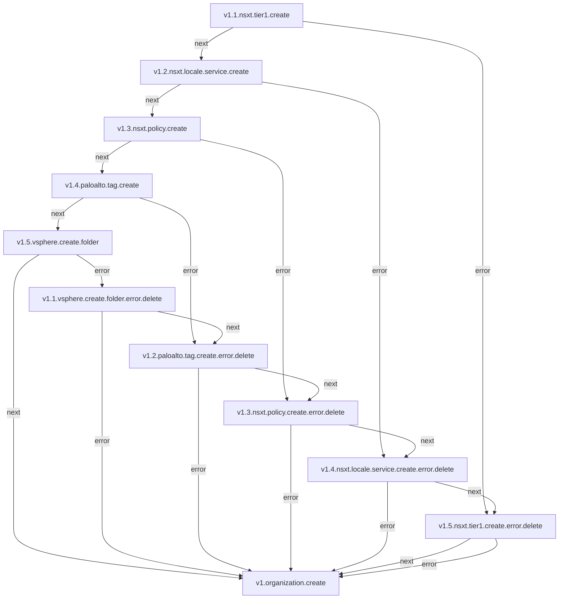
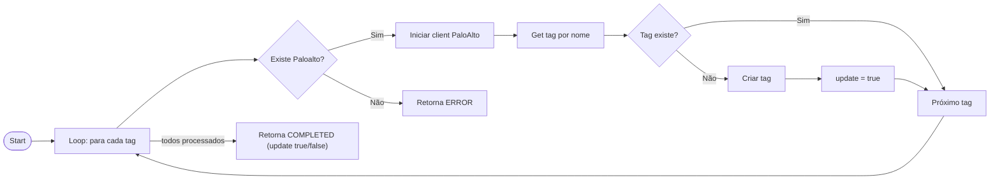

# Documentação Consolidada — Fluxos de Rede

Este README reúne em um único lugar os fluxos de tratamentos de recursos de rede usados neste projeto: NAT, Load Balancer, VPN e Public Address e demais itens. Inclui diagramas (Mermaid), templates genéricos (YAML/CLI) e checklists de validação.

---

## Índice

- [Visão Geral e Convenções](#visão-geral-e-convenções)
- [TAG](#tag)
---

## Visão Geral e Convenções

- Formato: Markdown com blocos Mermaid para diagramas.
- Estrutura de fluxo padrão: criação, edição e remoção.
- Exemplos: templates genéricos de chamadas a API do PaloAlto.

---

## TAG

**Objetivo:** Criação e remoção de Tag no Paloalto. Esse recurso está dentro do fluxo de criação de Organization. v1.4.paloalto.tag.create

### Fluxo



## Micro Serviço paloalto-tag - create

### Fluxo



### Payload no Micro Serviço

```json
{
  "PaloaltoTag": [
    {
      "ID": 10937,
      "CreatedAt": "2025-12-11T17:47:11Z",
      "UpdatedAt": "2025-12-11T17:47:11Z",
      "DeletedAt": null,
      "OrganizationID": 10175,
      "Name": "TFEMP5_CAU7LX_ate",
      "Identifier": "fisico"
    }
  ]
}
```

### End-Point API PaloAlto

> /restapi/v10.2/Objects/Tags

### Payload API PaloAlto

```json
{
  "tag": {
    "name": "TFEMP5_CAU7LX_ate",
    "color": "red",
    "comments": "TFEMP5_CAU7LX_ate"
  }
}
```


 