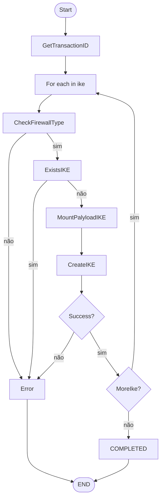
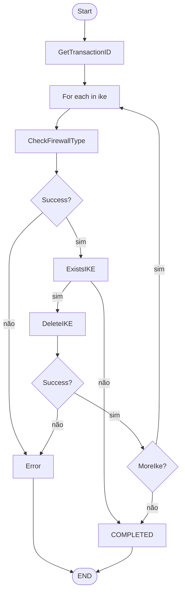

# IKE-GATEWAY

## Micro Serviço ike-gateway

### Fluxo - IKE Gateway Create



## Payload no Micro Serviço - ike-gateway

```json
{
  "ID": 641,
  "CreatedAt": "2025-12-19T13:11:36Z",
  "UpdatedAt": "2025-12-19T13:11:36Z",
  "DeletedAt": null,
  "VpnID": 917,
  "Name": "TEZDNB_CGNRO8_ate-8",
  "Password": "j,\"8jT~)GJbUt)Wm{g3]",
  "IkeVersion": "ikev2-preferred",
  "Ikev1Profile": "Totvs_default",
  "Ikev2Profile": "Totvs_default",
  "Ikev1ExchangeMode": "auto",
  "IkeLocalAddressIp": "181.41.161.254/32",
  "IkeLocalAddressInterface": "loopback.3",
  "PeerAddress": "200.49.58.170",
  "LocalAddress": "181.41.161.254",
  "Identifier": "fisico"
}
```

### End-Point API PaloAlto - IKE Gateway

> /restapi/v10.2/Network/IKEGateways

### Payload API PaloAlto - IKE Gateway

```json
{
  "entry": {
    "@name": "TEZDNB_CGNRO8_ate-8",
    "peer-address": {
      "ip": "200.49.58.170"
    },
    "local-address": {
      "ip": "181.41.161.254/32",
      "interface": "loopback.3"
    },
    "peer-id": {
      "type": "ipaddr",
      "id": "200.49.58.170"
    },
    "local-id": {
      "type": "ipaddr",
      "id": "181.41.161.254"
    },
    "authentication": {
      "pre-shared-key": {
        "key": "j,\"8jT~)GJbUt)Wm{g3]"
      }
    },
    "protocol": {
      "version": "ikev2-preferred",
      "ikev1": {
        "exchange-mode": "auto",
        "ike-crypto-profile": "Totvs_default",
        "dpd": {
          "enable": "yes"
        }
      },
      "ikev2": {
        "ike-crypto-profile": "Totvs_default",
        "dpd": {
          "enable": "yes"
        }
      }
    },
    "protocol-common": {
      "nat-traversal": {
        "enable": "no"
      },
      "fragmentation": {
        "enable": "no"
      }
    }
  }
}
```

### Fluxo - IKE Gateway Delete



## Payload no Micro Serviço - ike-gateway delete

```json
{
  "Name": "TEZDNB_CGNRO8_ate-8"
}
```

### End-Point API PaloAlto - IKE Gateway Delete

> /restapi/v10.2/Network/IKEGateways

### Payload API PaloAlto - IKE Gateway Delete

```json
{
  "entry": {
    "@name": "TEZDNB_CGNRO8_ate-8"
  }
}
```
