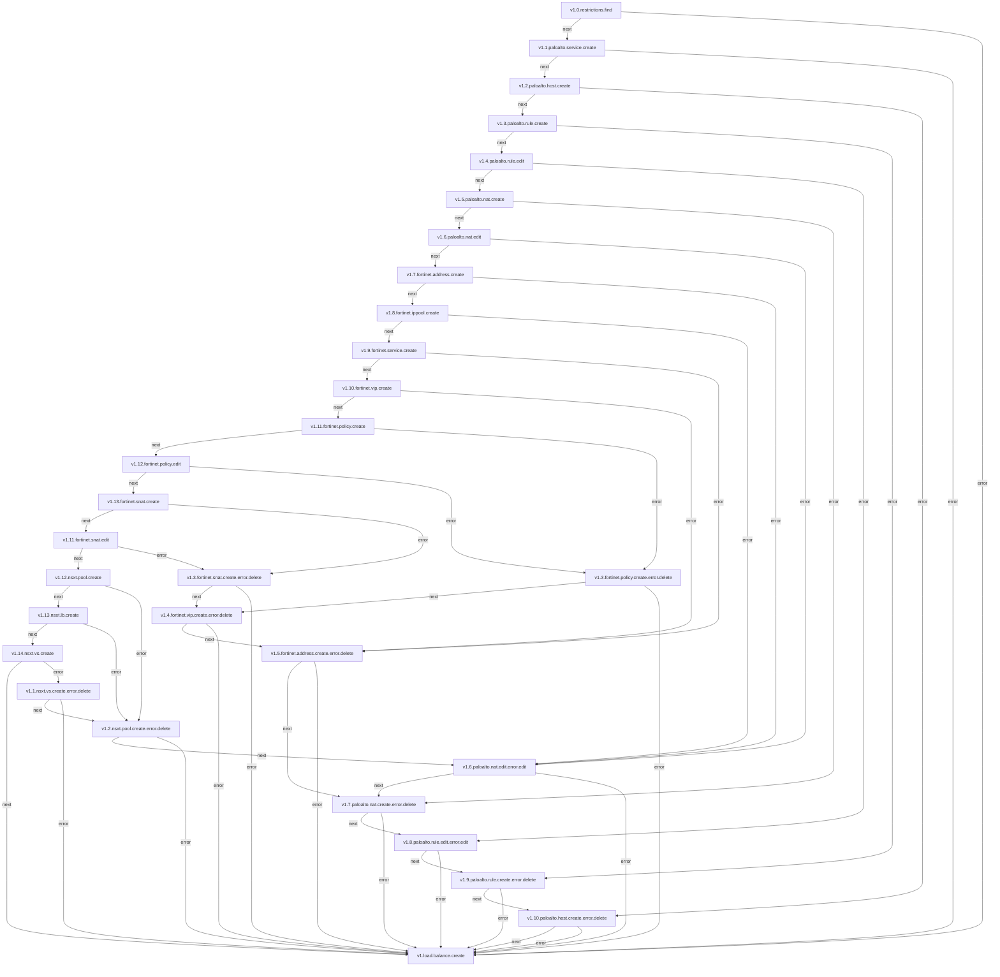
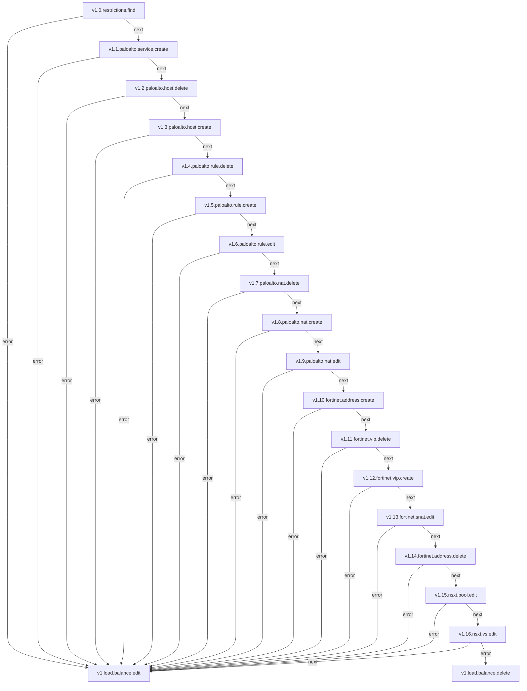
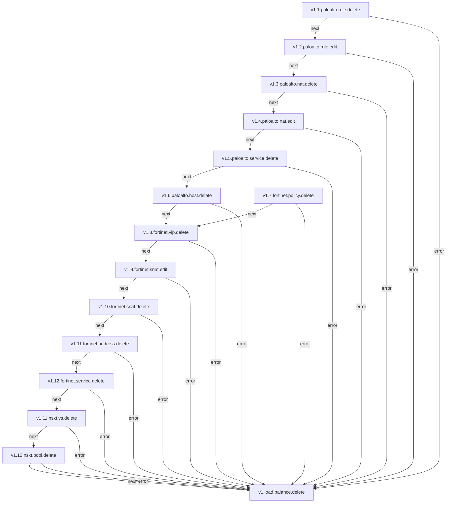

# Load-Balancers

**Objetivo** Configurar Load Balancers para distribuir o tráfego de rede entre múltiplos servidores, garantindo alta disponibilidade e desempenho otimizado dos serviços oferecidos.

## Fluxo - Load Balancer Create

## Fluxo - Load Balancer Edit

## Fluxo - Load Balancer Delete

