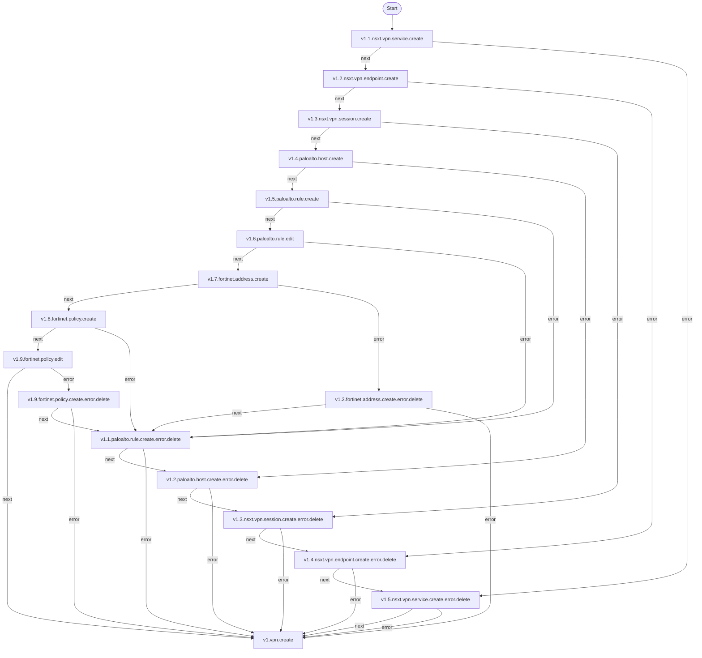
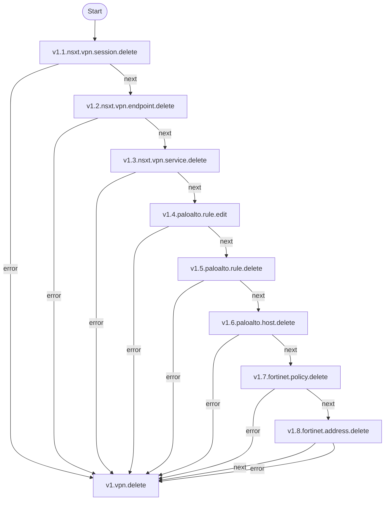

# SDN-VPNS

**Objetivo:** Criar e gerenciar uma rede privada virtual (VPN) utilizando Software-Defined Networking (SDN) para melhorar a segurança, flexibilidade e gerenciamento da rede.

## Fluxo - SDN-VPN Create

### Serviços envolvidos

- [v1.4.paloalto.host.create](paloalto-host.md#fluxo---host-create)
- [v1.5.paloalto.rule.create](paloalto-rule.md#fluxo---rule-create)
- [v1.6.paloalto.rule.edit](#)

## Fluxo - SDN-VPN Delete

