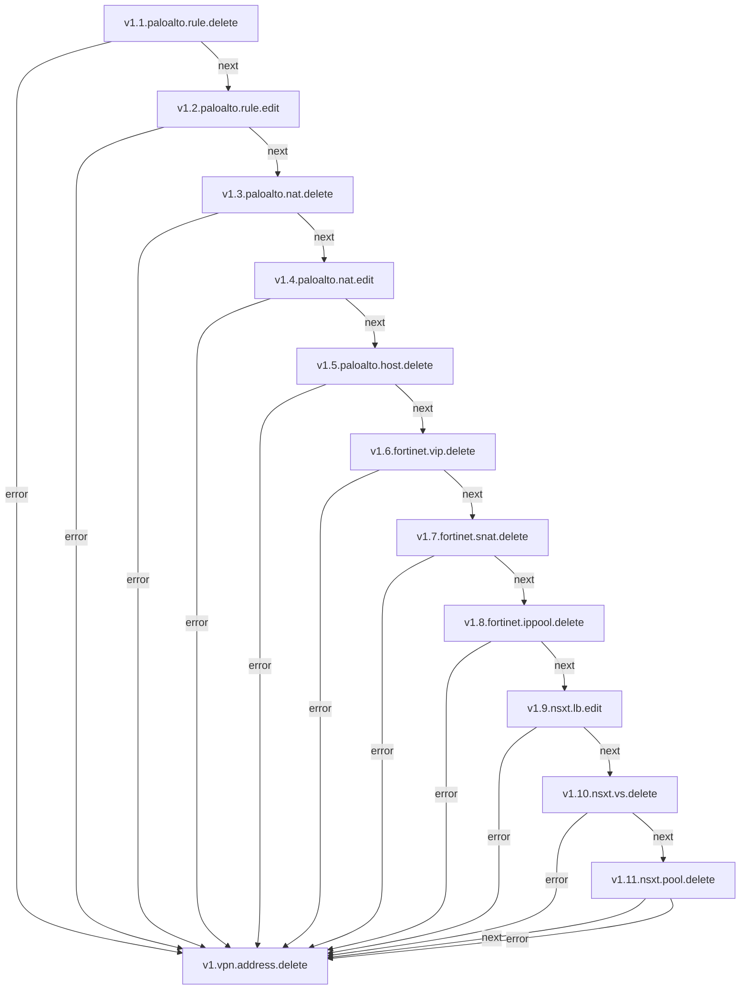

# VPN-ADDRESS

**Objetivo** Configurar endereços VPN em dispositivos PaloAlto para permitir a comunicação segura entre redes remotas e a rede corporativa, garantindo a integridade e confidencialidade dos dados transmitidos.

## Fluxo - VPN Address Delete

