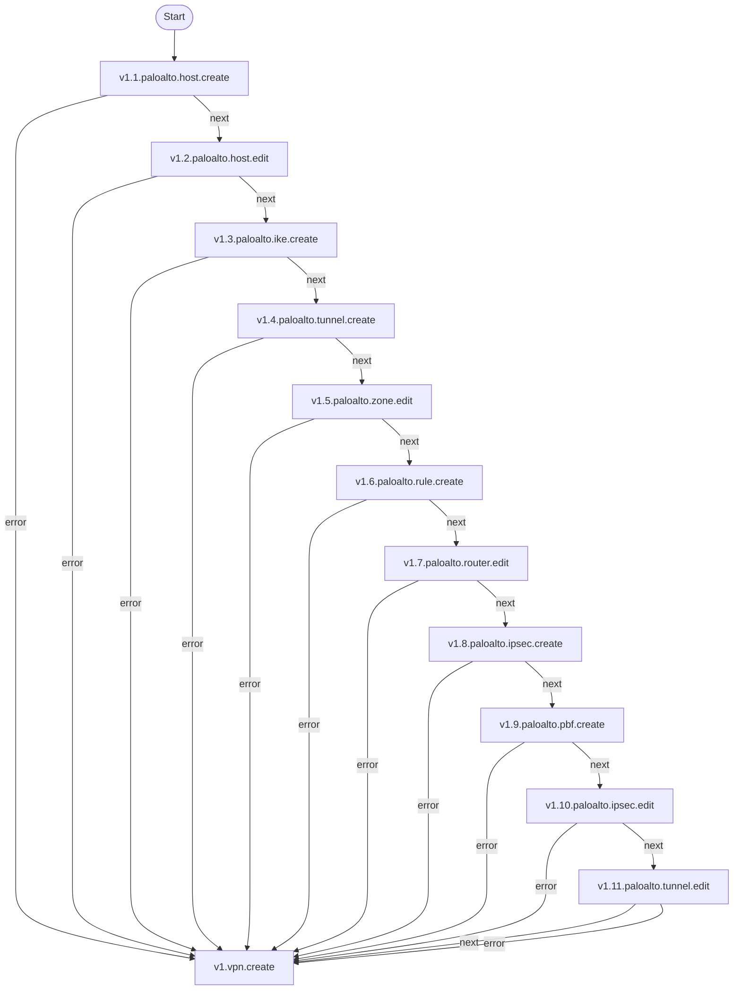
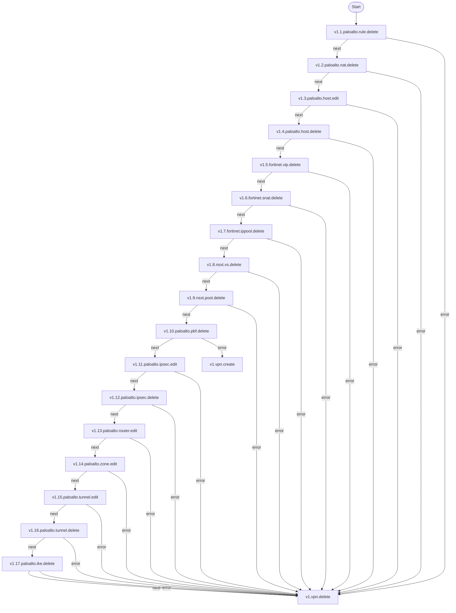

# VPNs

**Obejtivo** Configurar VPNs (Virtual Private Networks) para permitir conexões seguras e criptografadas entre redes remotas e a rede local, garantindo a integridade e confidencialidade dos dados transmitidos.

## Fluxo - VPN Create

## Fluxo - VPN Delete

